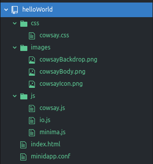
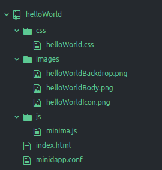
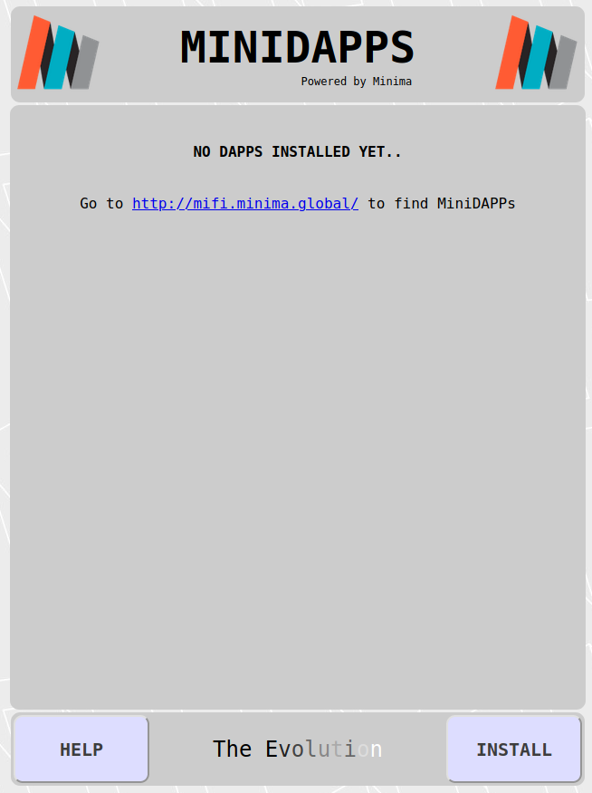
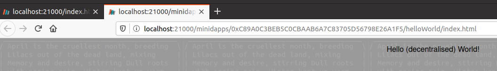
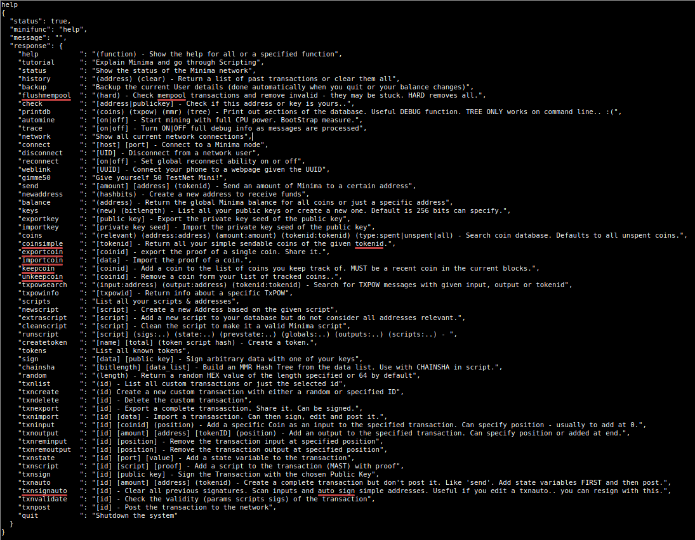

# How to Build Your First MiniDapp

This is a brief doc' designed to help you create your first Minima MiniDapp. And in the best traditions of Computing, the MiniDapp we'll create outputs a version of the immortal words, _"Hello World"_. Obvs.

## Prerequisites

First, clone the [MiniDAPP](https://github.com/minima-global/MiniDAPP) repository to a local directory (since you're reading a file in that repository, you _may_ have already done that).

Then do the same with the [Minima](https://github.com/minima-global/Minima) repository. Change to its directory, and type:

````
java -jar ./jar/minima.jar
````

Importantly, for our purposes, that command fires up a MiniDapp Server at [http://localhost:9004](http://localhost:9004). We'll use that server, later.

## Creatively Commandeer

There is no need to start from scratch when creating your first MiniDapp, since plenty of public domain minidapps have already been written; we'll commandeer one of those - [cowsay](https://github.com/glowkeeper/cowsayMinima). Clone that repository into a directory called _cowsayMinima_ (you have just cloned the very first publicly written MiniDapp (its creator went on to work for Minima), so take a moment to savour the importance of that act &#128521;)

Let's imagine you cloned the cowsay repo' into _/home/alice/gitRrepos/cowsayMinima_. Then:

```
cd /home/alice/gitRrepos/
cp -R cowsayMinima helloWorld
```

You now have a great template from which you can start your minidapp journey...

## Introduce Your MiniDapp to the World

If all has gone well, you should now have a _helloWorld_ directory containing all the goodness (and more) of [cowsay](https://github.com/glowkeeper/cowsayMinima). Open that directory in your favourite IDE - here's what that looks like in [atom](https://atom.io/):



First thing we're going to do is tidy up a bit by removing things we don't need and renaming those that we do:

1. Rename _cowsay.css_ to _helloWorld.css_
2. Rename all the files in the _images_ directory so they say _helloWorld_, rather than _cowsay_. Better still, if you are able to create your own amazing artwork for _helloWorldBackdrop.png_, _helloWorldBody.png_ and _helloWorldIcon.png_, do so now &#128521;)
3. Remove the _cowsay.js_ and _io.js_ files from the _js_ directory, since they are no longer required (fyi, _io.js_ makes _cowsay_ do some io, and _cowsay.js_ was a CommonJS port of https://github.com/schacon/cowsay)

Your `helloWorld` directory should look like this:



We're going to make the _helloWorld_ MiniDapp say, well, _"Hello World!"_ (or something similar). Edit _index.html_, and make it look like this:

```
<html>

	<head>

		<script type="text/javascript" src="./js/minima.js"></script>

		<link rel="stylesheet" type="text/css" href="./css/helloWorld.css">

	</head>

	<body style="background-image: url(./images/helloWorldBody.png);">

		<script type="text/javascript">

			window.addEventListener("load", function(){
				//Listen for Minima Events
				window.addEventListener('MinimaEvent', function(evt) {});

				//Initialise the MiniDapp - when doing things on Minima, you must always call this first
				Minima.init();
			});

		</script>

		<center>

			<div class='background'>

				<p>Hello (decentralised) World!</p>

			</div>

		</center>

	</body>

</html>
```

Finally, make your _minidapp.conf_ look like this:

```
{
	"name":"Hello World",
	"headline":"Hello Minima MiniDapps",
	"description":"Hello (decentralised) World",
	"version": "1.0.0",
	"lastKey": "",
	"background":"./images/helloWorldBackdrop.png",
	"icon":"./images/helloWorldIcon.png",
	"category":"Development"
}
```

## Zip Up Your MiniDapp

If you look in the [MiniDAPP](https://github.com/minima-global/MiniDAPP) repository's [MiniDapps directory](../www/minidapps/), you'll see a file called `buildscript.sh`. Add _helloWorld_ to the end of that:

```
#!/bin/sh

rm -rf ./bin

mkdir bin

zip -r ./bin/futurecash.minidapp futurecash

zip -r ./bin/terminal.minidapp terminal

zip -r ./bin/scriptide.minidapp scriptide

zip -r ./bin/dexxed.minidapp dexxed

zip -r ./bin/coinflip.minidapp coinflip

zip -r ./bin/blockx.minidapp blockx

zip -r ./bin/cowsay.minidapp cowsay

cp ./miniwallet/walletv98.06.minidapp ./bin/
cp ./block/blockv1.3.17.minidapp ./bin/

zip -r ./bin/helloWorld.minidapp helloWorld
```

Now drop out of your favourite editor (if it's not [atom](https://atom.io/), why not?), and run `buildscript.sh`. If all went well, you should have a number of _.minidapp_ files in the [www/minidapps/bin](../www/minidapps/bin) directory, including _helloWorld.minidap_. It's time to introduce it to the world!

## Hello World!

[Earlier](#prerequisites), we fired up a MiniDapp Server at [http://localhost:9004](http://localhost:9004) - we're going to connect to that now. Start your favourite browser ([Firefox](https://www.mozilla.org/en-GB/firefox/new/)), and load [http://localhost:9004](http://localhost:9004). If all has gone well, you should see something like this (actually, the screenshot below shows a very early version of the MiniDapp Hub - it's been left here for posterity, but you should see something looking ever-so-slightly more modern &#128515;):



Click on `Install`, then go find the _helloWorld.minidapp_ we created earlier. If that went well, you should now see the installed _Hello World_ MiniDapp in the MiniDapp Hub. Click on that, and you _should_ see this:



**Boom!** Congratulations! Welcome to the world of Minima MiniDapps!

## What Next?

Although _helloWorld.minidapp_ is fit for purpose (Hey, it outputs "Hello World!" (almost)), it doesn't actually interact with the Minima network. So the next step is to do just that by investigating the Minima API. A good way of seeing what's available there is to run the _terminal_ MiniDapp  (which we created earlier when we ran `buildscript.sh`). Install that, load it, then type help:



You could get some ideas from the other MiniDapps, too - for example, [cowsay](https://github.com/glowkeeper/MiFi/www/minidapps/cowsay) makes use of the Minima `random` command. But there are endless more possibilities...

Good luck!
